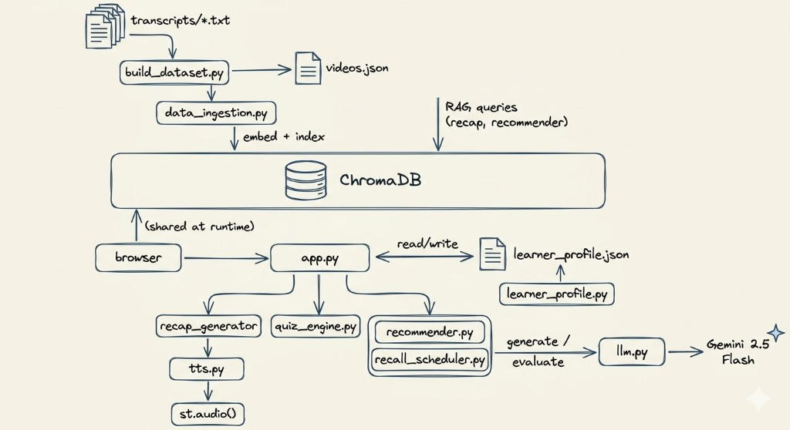

# AI Revision Coach

An AI-powered retention system for micro-learning. After watching a short educational video, it generates a personalized recap, runs an adaptive quiz, recommends what to watch next, and schedules spaced-repetition recall checks — all driven by a continuously updated learner profile.

---

## System Design

<p align="center">
  
</p>

**Adaptation loop:** every learner action (quiz answer, recall attempt) updates the profile, which changes what the system does next — difficulty, recap focus, recommendations, and recall targets all shift in real time.

---

## How to Run

```bash
python3 -m venv venv
source venv/bin/activate
pip install -r requirements.txt
```

Create `.env`:
```
GOOGLE_API_KEY=your_gemini_api_key
```

```bash
python build_dataset.py    # parse transcripts → embed → index in ChromaDB
python test_backend.py     # run all 10 backend tests
streamlit run app.py       # launch Streamlit UI
```

Use the **Profile Management** buttons in the sidebar to start fresh, load a quick 3-video demo, or load a full 6-video synthetic history. The **"Force Recalls Due Now"** button makes spaced-repetition demos instant.

---

## Project Structure

```
app.py               # Streamlit UI (5 tabs)
config.py            # all thresholds, model names, file paths
llm.py               # unified LLM interface (Gemini / Azure OpenAI)
tts.py               # offline TTS via Piper (en_US-lessac-medium)
build_dataset.py     # parse transcripts → videos.json + ChromaDB index
data_ingestion.py    # embed & index video chunks
learner_profile.py   # mastery tracking, difficulty calc, weakness detection
recap_generator.py   # dual-query RAG personalized recap
quiz_engine.py       # adaptive quiz with live difficulty adjustment
recommender.py       # next-video recommendation engine
recall_scheduler.py  # spaced repetition + LLM-as-judge evaluation
metrics.py           # learning impact metrics
synthetic_data.py    # generate synthetic learner profiles for demo
test_backend.py      # 10 backend tests (all passing)

transcripts/         # 15 raw YouTube transcript .txt files
data/                # generated: videos.json, learner_profile.json
chroma_db/           # persistent ChromaDB vector store
piper_models/        # offline TTS voice model (~60MB, gitignored)
```

---

## Tech Stack

| Component | Choice |
|-----------|--------|
| LLM | Gemini 2.5 Flash |
| Embeddings | all-MiniLM-L6-v2 (local, 384-dim) |
| Vector DB | ChromaDB (persistent) |
| TTS | Piper TTS (offline neural, en_US-lessac) |
| UI | Streamlit |
| Data | JSON files |
| Runtime | Python 3.11+ |

---
